<!-- prettier-ignore-start -->
# DevOps in pillole
{: .no_toc }

- TOC
{:toc}

<!-- prettier-ignore-end -->

# DevOps: Sicurezza e Automazione per Team Agili

Prima dell'avvento delle pratiche DevOps, lo sviluppo software seguiva un modello rigidamente compartimentato che in molte organizzazioni persiste ancora oggi.
Gli sviluppatori scrivevano codice per settimane o mesi, poi lo passavano al team di QA, che a sua volta, dopo ulteriori settimane di test, lo passava al team operations per il deployment. Ogni step era un collo di bottiglia: configurazioni manuali su server, deployment notturni del venerdì sera con l'intero team in conference call, e l'inevitabile gioco dello "scaricabarile" quando qualcosa andava storto in produzione ("funzionava nel mio ambiente 😅").

La sicurezza era relegata a un audit finale prima del rilascio - una checklist che spesso diventava un ostacolo da aggirare piuttosto che un alleato.
Le vulnerabilità scoperte a ridosso del deploy causavano ritardi di mesi o, peggio, venivano ignorate con la promessa di "fixarle nella prossima release".
Gli sviluppatori non avevano visibilità su cosa accadesse in produzione, mentre gli operations non capivano il codice che dovevano mantenere in vita. Il risultato? Cicli di rilascio misurati in trimestri, fix di emergenza nel weekend, e una cultura della paura dove ogni deploy era un evento ad alto rischio.

Questa realtà non è storia vecchia: molte aziende, specialmente in settori regolamentati o con sistemi legacy complessi, operano ancora così.
La differenza è che ora questo approccio non è più sostenibile - il mercato punisce chi non riesce ad adattarsi rapidamente, e i competitor che hanno adottato DevOps rilasciano feature mentre altri sono ancora in fase di pianificazione.

La cultura DevOps enfatizza la responsabilità condivisa, empatia, trasparenza e miglioramento continuo, spesso riassunti nei principi CAMLS: Culture, Automation, Measurement, Lean, Sharing. Questo cambiamento di mindset, supportato da pratiche Agile e Lean, rende lo sviluppo incrementale e la distribuzione rapida parte integrante del lavoro quotidiano.

## La Soluzione: DevOps come filosofia, non solo tool

DevOps è l’unione di persone, processi e tecnologia che integra sviluppo e operations per erogare valore in modo continuo, rapido e affidabile agli utenti finali.
In pratica è una filosofia culturale con pratiche e strumenti che favoriscono collaborazione e automazione lungo tutto il ciclo di vita del software.

DevOps combina sviluppo (Dev) e operazioni (Ops) abbattendo i silos tra team e responsabilità, così che gli ingegneri lavorino insieme dalla pianificazione alla produzione con competenze multidisciplinari condivise. L’obiettivo è aumentare velocità, qualità e sicurezza del delivery rispetto ai processi tradizionali, integrando feedback rapidi e miglioramento continuo. In questo quadro, DevSecOps estende DevOps integrando la sicurezza fin dall’inizio del ciclo di sviluppo con responsabilità condivise e controlli “shift‑left”. In parallelo, la Developer Experience (DevEx) si focalizza sul ridurre l’attrito per gli sviluppatori — strumenti, flussi e ambienti efficaci — per massimizzare il flow e la produttività; entrambi i temi saranno approfonditi più avanti.

### Pratiche e obiettivi

- **Continuous Integration e Continuous Delivery** per rilasci frequenti e affidabili tramite pipeline automatizzate
- **Infrastructure as Code**, configurazione e provisioning automatizzati per ambienti coerenti e ripetibili
- **Test automatizzati**, monitoraggio e osservabilità per ridurre MTTR (_tempo medio necessario per ripristinare un servizio dopo che si è verificato un guasto o un problema_) e aumentare stabilità e affidabilità
- **Integrazione della sicurezza nel ciclo di sviluppo** (DevSecOps) con responsabilità condivisa e controlli “shift‑left”
- **Collaborazione cross‑funzione e condivisione della responsabilità** per accelerare il time‑to‑market e il vantaggio competitivo
- **Developer Experience (DevEx)** come pratica trasversale: toolchain coerente, ambienti locali e preview veloci, automazione dell’“inner loop”, riduzione del carico cognitivo e piattaforme self‑service.

## La Sicurezza: DevSecOps senza overhead

DevSecOps integra le pratiche di sicurezza in tutti i processi DevOps, generando automaticamente artifact di sicurezza e compliance durante l'intero processo, inclusi sviluppo, build, packaging, distribuzione e deployment.

### Principi Fondamentali del DevSecOps

**Shift Left Security**: La sicurezza non è più una fase finale, ma inizia dal primo commit. Questo significa:

- Analisi di vulnerabilità nel codice durante la scrittura
- Scansione delle dipendenze in tempo reale
- Policy as Code (regole come codice) per definire regole di sicurezza

**Security by Design**: Ogni decisione architetturale considera l'impatto sulla sicurezza. Per team piccoli, questo si traduce in:

- Template di progetto con security baseline
- Checklist di sicurezza integrate nel workflow
- Automazione di controlli di compliance

## L'Esperienza: DevEx come moltiplicatore

La Developer Experience (DevEx) rappresenta l'insieme delle percezioni, sentimenti e risposte che gli sviluppatori hanno mentre interagiscono con strumenti, processi, pratiche e culture nel loro ambiente di lavoro. Non è semplicemente una questione di tool migliori, ma un approccio sistemico che considera ogni punto di frizione nel percorso dello sviluppatore - dal momento in cui apre l'IDE fino al deploy in produzione.

### Componenti Chiave della DevEx

La DevEx si fonda su tre dimensioni interconnesse che determinano la produttività e la soddisfazione degli sviluppatori:

**Flow State e Focus Time**: La capacità di entrare e mantenere uno stato di concentrazione profonda è fondamentale per il lavoro creativo dello sviluppo software. Questo richiede:

- Minimizzazione delle interruzioni e context switching
- Tool che rispondono istantaneamente senza breaking del flusso di pensiero
- Processi asincroni che non bloccano il lavoro in attesa di approvazioni

**Autonomia e Self-Service**: Gli sviluppatori devono poter operare indipendentemente senza dipendenze esterne eccessive:

- Accesso diretto agli ambienti di sviluppo e test
- Capacità di provisioning risorse senza ticket
- Documentazione e tool discoverable che non richiedono training estensivo

**Feedback Loop Quality**: La qualità e velocità del feedback determina quanto rapidamente uno sviluppatore può iterare e migliorare:

- Build e test che completano in minuti, non ore
- Error messages chiari e actionable che guidano verso la soluzione
- Metriche di performance accessibili che mostrano l'impatto del proprio lavoro

Questi principi si traducono in pratiche concrete: ambienti di sviluppo standardizzati ma personalizzabili, pipeline CI/CD che "funzionano e basta", documentazione che vive accanto al codice, e tool che amplificano le capacità piuttosto che aggiungere complessità. Per team piccoli, una buona DevEx non è un lusso ma una necessità strategica - è ciò che permette a poche persone di competere con organizzazioni molto più grandi, eliminando friction e moltiplicando l'efficacia di ogni singolo sviluppatore.

## I Pilastri: CALMS framework applicato

Il framework CALMS(Culture Automation Lean Measurement Sharing), coniato da Jez Humble co-autore di "The DevOps Handbook", valuta la capacità di un'azienda di adottare processi DevOps e rappresenta un modo per misurare il successo durante una trasformazione DevOps. L'acronimo sta per Culture, Automation, Lean, Measurement e Sharing.

### Applicazione Pratica del CALMS per Team Piccoli

**Culture**: In team piccoli, la cultura si forma rapidamente ma è fragile:

- Responsabilità condivisa del codice (no "not my code" mentality)
- Fail fast, learn fast: gli errori sono opportunità di apprendimento
- Transparency: tutti sanno su cosa stanno lavorando gli altri

**Automation**: L'automazione è il moltiplicatore di forza per team piccoli:

- Ogni processo ripetuto più di 3 volte deve essere automatizzato
- Pipeline che gestiscono tutto: da commit a produzione
- Self-service per operazioni comuni

**Lean**: Eliminare tutto ciò che non aggiunge valore:

- Processi semplici e lineari
- Riduzione dei handoff tra persone
- Focus su metriche che guidano decisioni concrete

**Measurement**: Misurare per migliorare, non per punire:

- Metriche tecniche (deployment frequency, lead time)
- Metriche di business (user satisfaction, feature adoption)
- Feedback quantitativo su processi interni

**Sharing**: La conoscenza deve fluire liberamente:

- Documentazione living integrata nel codice
- Post-mortem senza colpa per incidenti
- Knowledge sharing sessions regolari

## 6. La Pratica: Implementazione step-by-step

### Fase 1: Security-First Setup

Prima di scrivere la prima riga di codice applicativo, stabilisci i foundation di sicurezza come prerequisito non negoziabile.
Il Principio: Security as Code
Trasforma le policy di sicurezza da procedure manuali a codice eseguibile.

```mermaid
graph TD
    A[📝 PRIMA: Approccio Manuale] --> B[👨‍💻 Developer scrive codice]
    B --> C[📋 Checklist manuale]
    C --> D{🤔 Ricorda di controllare<br/>vulnerabilità?}
    D -->|Si| E[🔍 Controllo manuale]
    D -->|No| F[❌ Deploy senza controlli]
    E --> G{🎯 Trova vulnerabilità?}
    G -->|Si| H[📞 Segnala al team]
    G -->|No| I[✅ Deploy manuale]
    H --> J[⏰ Attesa fix manuale]
    F --> K[🚨 Vulnerabilità in produzione]

    L[⚙️ ORA: Security as Code] --> M[👨‍💻 Developer scrive codice]
    M --> N[🔄 Git push]
    N --> O[🤖 Pipeline automatica]
    O --> P[🔍 Dependency Scan]
    P --> Q[🔐 Secret Detection]
    Q --> R[📄 License Check]
    R --> S[🛡️ Vulnerability Scan]
    S --> T{🚦 Rispetta la policy?}
    T -->|Si| U[✅ Deploy automatico]
    T -->|No| V[❌ Build fallisce]
    V --> W[📧 Notifica automatica]
    W --> X[🔧 Developer corregge]
    X --> N

    style A fill:#ffcccc
    style L fill:#ccffcc
    style K fill:#ff9999
    style U fill:#99ff99
    style F fill:#ff9999
    style V fill:#ffcc99
```

Ogni commit e deploy viene automaticamente validato contro questi criteri.
Se non rispetta gli standard, il processo si ferma - nessun intervento umano necessario.
Questo è Security as Code: policy di sicurezza che si auto-applicano attraverso automazione, non attraverso documenti o checklist manuali.

### Fase 2: Security Integrata e continua

Durante lo sviluppo, la sicurezza è continua e automatica:

**Strumenti Integrati nello Sviluppo**:

- Security linter nell'IDE che evidenzia problemi prima del commit
- Pre-commit hook che bloccano commit non sicuri
- Dependency vulnerability warnings in tempo reale

### Fase 3: Pipeline di Rilascio Automatizzate

La pipeline trasforma il codice in valore business in modo sicuro e ripetibile:

**Stage della Pipeline**:

1. **Validate**: Syntax check, formatting, basic rules
2. **Security Scan**: Static analysis, dependency check, secret detection
3. **Test**: Unit, integration, security tests
4. **Build**: Artifact creation con security hardening
5. **Deploy**: Deployment automatico con verification
6. **Monitor**: Health check e security monitoring

## La Misura: Come sapere se funziona

Post-deployment, il sistema fornisce feedback continuo attraverso metriche oggettive che indicano la salute del processo DevOps. Misurare non significa controllare, ma capire dove intervenire per migliorare.

### DORA Metrics: Il Gold Standard della Performance

Le metriche DORA (DevOps Research and Assessment) sono quattro indicatori chiave che predicono le performance di un'organizzazione software:

- **Deployment Frequency**: Quanto spesso rilasciamo in produzione
- **Lead Time for Changes**: Tempo dal commit al codice in produzione
- **Mean Time to Recovery (MTTR)**: Quanto velocemente ripristiniamo dopo un incidente
- **Change Failure Rate**: Percentuale di deploy che causano failure in produzione

### Security Metrics: Sicurezza Quantificabile

La sicurezza non può essere un'impressione, deve essere misurabile:

**Vulnerabilities Management**:

- Mean Time to Detection (MTTD): Tempo per scoprire una vulnerabilità
- Mean Time to Remediation (MTTR): Tempo per fixare dopo la scoperta
- Vulnerability Density: Numero di vulnerabilità per 1000 linee di codice
- Critical vs High vs Medium: Distribuzione per severità

**Compliance Score**:

- Percentage of compliant deployments: Deploy che passano tutti i security gates
- Policy violations per sprint: Trending di violazioni nel tempo
- Security debt ratio: Vulnerabilità note non ancora risolte vs nuove feature

**Security Coverage**:

- Percentage di codice coperto da SAST/DAST
- Dipendenze scansionate vs totale
- Secret scanning hit rate e false positive rate

### DevEx Metrics: L'Esperienza Quantificata

Developer Experience non è solo sentiment, ma può essere misurata oggettivamente:

**Developer Satisfaction (Survey-based)**:

- Net Promoter Score (NPS) del team
- Tool satisfaction rating per ogni strumento nella toolchain
- Perceived productivity score (self-reported)
- Frequenza ideale: Quarterly pulse survey

**Onboarding Time**:

- Time to first commit: Dal day 1 al primo codice in repository
- Time to first production deploy: Quando un nuovo developer deploya autonomamente
- Time to independence: Quando non necessita più mentoring costante
- Benchmark: < 1 settimana per first commit, < 1 mese per independence

**Context Switching Metrics**:

- Number of tools used daily: Meno è meglio (ideale < 5)
- Average interruptions per day: Meeting, incident, support requests
- Focus time blocks: Ore consecutive senza interruzioni
- Work In Progress (WIP) items: Task parallele per developer

### Metriche Operative Aggiuntive

**Build & Pipeline Health**:

- Build success rate: Percentage di build che completano con successo
- Average build time: Durata media della pipeline end-to-end
- Flaky test rate: Test che falliscono intermittentemente
- Pipeline bottlenecks: Stage che rallentano il flusso

**Code Quality Trends**:

- Code coverage trajectory: Trending della copertura test
- Technical debt ratio: Tempo stimato per fix vs nuovo sviluppo
- Code review turnaround: Tempo medio per review approval
- Documentation freshness: Ultima modifica doc vs codice correlato

**Alert e Threshold**:

- MTTR > 4 ore: Alert immediato
- Build success rate < 80%: Review processo richiesto
- Vulnerability critical non fixata > 24h: Escalation automatica
- Developer NPS < 7: 1-on-1 meeting triggered

## Conclusione

Il DevOps moderno non è più opzionale: è la baseline per esistere nel mercato software contemporaneo. Non è una destinazione ma un viaggio di miglioramento continuo.
Team che iniziano questo percorso oggi, che abbracciano l'automazione come filosofia e la sicurezza come principio fondante, non stanno solo costruendo software migliore - stanno costruendo organizzazioni antifragili che diventano più forti ad ogni sfida.

Iniziate oggi, iniziate piccoli, ma iniziate.
Ogni pipeline automatizzata, ogni security check aggiunto, ogni metrica monitorata è un passo verso un futuro dove il vostro team piccolo può battere i giganti nonostante le sue dimensioni, ma proprio grazie alla sua agilità potenziata dal DevOps.

## Bibliografia e Fonti

1. **Atlassian CALMS Framework**: https://www.atlassian.com/devops/frameworks/calms-framework - Framework di valutazione DevOps
2. **NIST DevSecOps Practices**: https://www.nccoe.nist.gov/projects/secure-software-development-security-and-operations-devsecops-practices - Standard di sicurezza
3. **Scaled Agile Framework DevOps**: https://framework.scaledagile.com/devops - Definizioni e pratiche DevOps
4. **Cprime CALMS Analysis**: https://www.cprime.com/resources/blog/defining-the-5-devops-principles-calms/ - Analisi dettagliata principi CALMS
5. **Microsoft Developer Experience**: https://developer.microsoft.com/en-us/developer-experience - Definizione e framework DevEx
6. **Splunk DevEx Guide**: https://www.splunk.com/en_us/blog/learn/developer-experience-devex.html - Guida completa DevEx
7. **DevOps.com Security Best Practices**: https://devops.com/securing-the-devops-pipeline-tools-and-best-practices-2/ - Best practices sicurezza 2024
8. **Cortex DevOps Security Guide**: https://www.cortex.io/post/devops-security-best-practices - Strategie security moderne

## Disclaimer

Correzione ortografica e lessicale gentilmente offerta da una AI 🤖✍️: io ci ho messo le idee 💡, lei i congiuntivi 📚.
